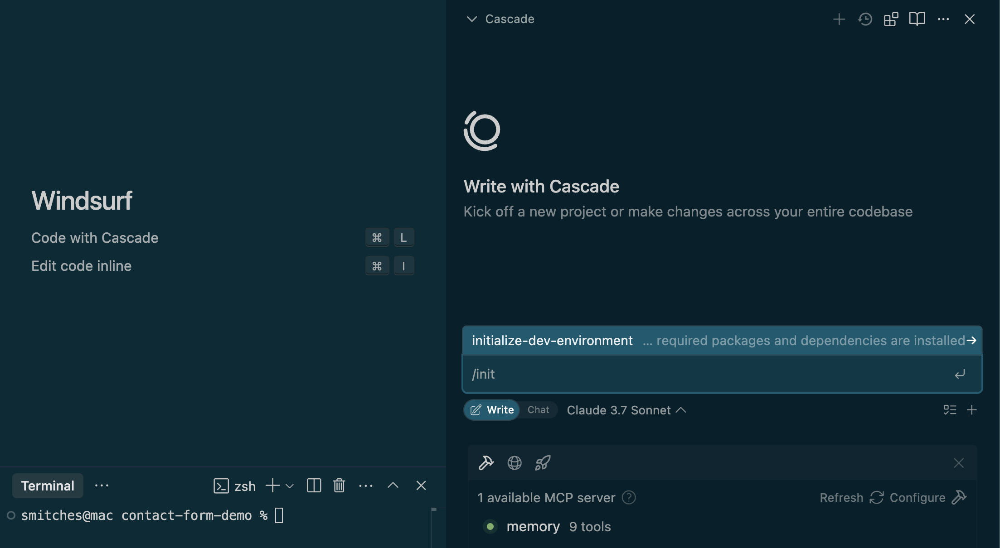

# Windsurf Editor Walkthrough

Welcome to the Windsurf Editor Walkthrough! This project is designed to help you quickly evaluate how Windsurf works as your AI coding assistant.

This sample repository contains a simple contact form application as an example codebase. You may follow the instructions in the `guides/` directory to explore various ways to interact with Windsurf and leverage its capabilities.

## Repository Structure

```
./
├── contact-form-app/     # Example codebase (React + Python)
└── guides/              # Introductory step-by-step Windsurf guides for each modality
    └── workshop/    # Advanced self-paced workshop following introductory tutorials
    └── faqs/        # Frequently Asked Questions
    └── best-practices/ # Best Practices
    └── for-administrators/ # intro to features of Windsurf relevant to Administrators
```

## Getting Started

The walkthroughs in `guides/` will guide you through various Windsurf features and demonstrate how to:
- Collaborate effectively with an AI coding assistant
- Navigate and understand existing codebases
- Make targeted code improvements
- Work with different interaction modalities

## Walkthrough Instructions
### Prerequisites
You will need to:
- Install the [Windsurf Editor](https://windsurf.com/download)
- Clone this repository
- Run the `/initialize-dev-environment` workflow in Cascade to setup your local development environment



### Option 1: Introductory Tutorials

Begin by following the guides in [guides](/guides) to explore different ways of working with Windsurf. While these files will be cloned to your local machine, it is recommended you open these files in Github for readability.

### Option 2: Advanced Workshop

Once you understand the core capabilities of Windsurf, you may proceed to the [Advanced Workshop](guides/workshop/README.md). This self-guided section presents open-ended challenges designed to help you explore and combine Windsurf's features in practical scenarios.

The advanced workshop will help you:
- Apply what you've learned in practical scenarios
- Discover effective combinations of Windsurf modalities
- Develop your own workflow preferences
- Tackle more complex development tasks

Note: While your specific interactions with Windsurf may vary, you should still gain an understanding of the core learning objectives to see how Windsurf can help you in your development workflow.
