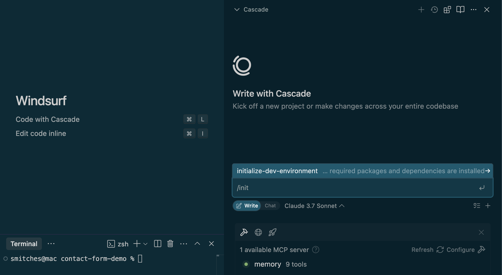

# Windsurf Walkthrough

Welcome to the Windsurf Walkthrough! This project includes a sample code base and suggested flows (prompts + user actions) as you get hands-on with the Windsurf Editor.

Instead of providing an exhaustive demonstration of all Windsurf's capabilities as your AI coding assistant, this project focuses on a few representative user flows and key takeaways for working with Windsurf.

For the latest information on Windsurf, check out [Windsurf University](https://windsurf.com/university) and the [Windsurf Documentation](https://docs.windsurf.com/windsurf/getting-started)

## Repository Structure

```
./
├── .github/workflows/
│   └── snyk-devin-fix.yml   # Snyk SAST scan + Devin auto-fix workflow
├── contact-form-app/        # Example codebase (React + Python)
└── walkthrough/             # Introductory step-by-step walkthroughs
    └── for-administrators/  # Reference material for Windsurf Administrators
    └── challenges/          # Open-ended tasks for Windsurf users to continue exploring
```

## Automated Security Remediation (Snyk + Devin)

This branch (`snyk`) includes a GitHub Actions workflow that automatically scans PRs for security vulnerabilities using [Snyk Code SAST](https://snyk.io/product/snyk-code/) and routes findings to [Devin](https://devin.ai) for automated remediation.

### How It Works

1. A PR is opened or updated against the `snyk` branch
2. The workflow installs project dependencies and runs `snyk code test`
3. If medium+ severity findings are detected, it creates a Devin v3 API session with instructions to fix the vulnerabilities
4. Devin checks out the PR branch, applies fixes, and pushes back
5. The workflow posts a PR comment summarizing findings and linking to the Devin session
6. On re-scan (triggered by Devin's push), if findings are resolved, no new session is created

### Devin Author Guard

To prevent infinite remediation loops, the workflow checks if the most recent commit on the PR branch was authored by Devin (`Devin AI` or `devin-ai-integration[bot]`). If so, no new Devin session is created — even if findings remain. This ensures at most one automated fix attempt per human-authored push.

### Required Secrets & Variables

Add these to your repository settings before using the workflow:

| Name | Type | Description |
|------|------|-------------|
| `SNYK_TOKEN` | Secret | Snyk API token for authentication |
| `DEVIN_API_KEY` | Secret | Devin service user API key (`cog_` prefix) |
| `DEVIN_ORG_ID` | Variable | Your Devin organization ID |

### Testing the Workflow

1. Create a branch off `snyk` with intentional vulnerabilities (e.g., hardcoded secrets, `eval()` usage, vulnerable dependencies)
2. Open a PR targeting the `snyk` branch
3. The workflow will run, detect findings, and create a Devin session
4. Devin will push fixes to your branch automatically

## Getting Started

### Prerequisites
You will need to:
- Install the [Windsurf Editor](https://windsurf.com/download)
- Clone this repository

- Run the `/initialize-dev-environment` workflow in Cascade to setup your local development environment



### Introductory Tutorials
Begin by working through the [walkthrough](./walkthrough) to explore sample flows that demonstrate how to effectively collaborate with your AI coding assistant. 

While these files are available on your local machine, it is recommended you open them in Github for better readability.

### Contributing

If you'd like to contribute to this project, please review the [CONTRIBUTING.md](CONTRIBUTING.md) file for guidelines on how to submit changes and improvements.

### Disclaimer on Non-deterministic Behavior

While your specific interactions with Windsurf may vary, the goal is to demonstrate how Windsurf helps you stay in the flow so you can dream bigger.
