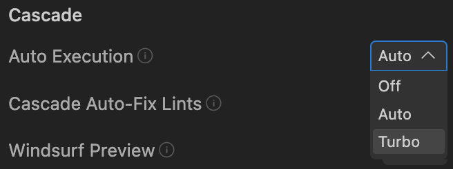
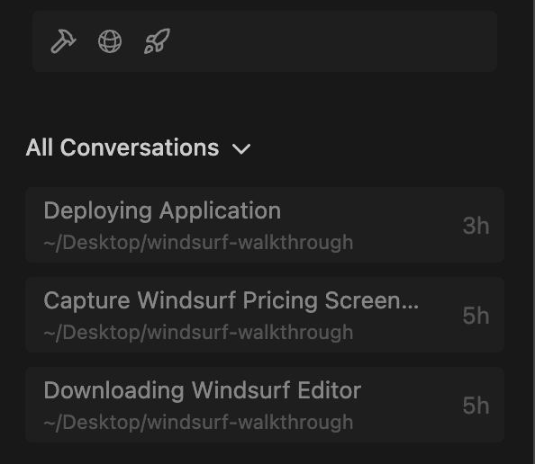
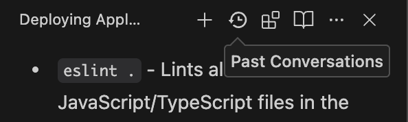
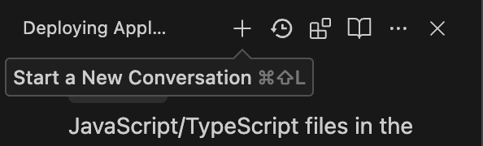
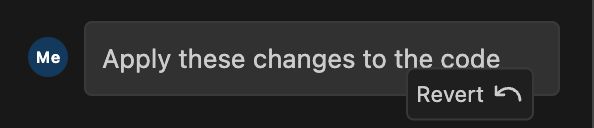
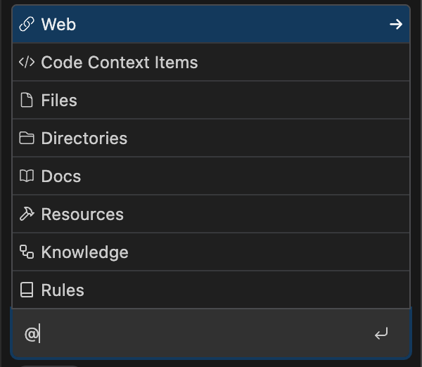
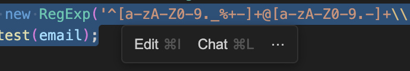
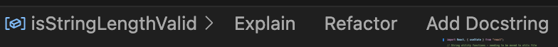
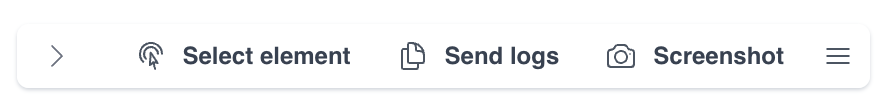
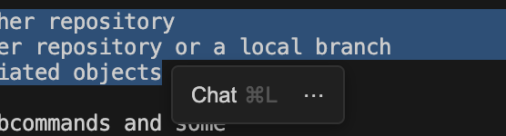

# Windsurf Cascade - Advanced

Windsurf Cascade is a Collaborative, Agentic AI-assistant and is the natural evolution of a Chat Assistant. Cascade has access to research your code base, invoke tools to edit your code and run terminal commands, and understand your recent actions (your current trajectory) to derive your next intent.

**Note:** Cascade is highly flexible as an Agentic System. This demo will walk through some of Cascade's advanced capabilities, but will be nonexhaustive.

## Table of Contents

- [Terminal Auto Execution](#terminal-auto-execution)
- [Previous Conversations](#previous-conversations)
- [Parallel Conversations](#parallel-conversations)
- [Reverting Actions](#reverting-actions)
- [Adding Context to Cascade](#adding-context-to-cascade)

### Terminal Auto Execution

As an agentic system, Cascade can automatically generate and run terminal commands. Cascade offers three modes to select from for running terminal commands: off, auto, and turbo. You can toggle between them by clicking the `Windsurf - Settings` button in the bottom right of the editor. Then, look for the `Auto Execution` option to select the mode you want:



### Previous Conversations

You can view previous conversations in the Cascade window underneath the toolbar. You can also toggle between conversations in your current workspace or all conversations with Cascade.



If you are already in a conversation, you can also access previous conversations by clicking the `Previous Conversations` button in the toolbar.



### Parallel Conversations

If Cascade is working on a task, you can start another task to have multiple conversations with Cascade at the same time by clicking the `Start a New Conversation` button in the toolbar. Cascade will continue working on the first task while you work on the second task.



### Reverting Actions

If you need to revert your codebase to a previous state in a conversation with Cascade, you can do so by hovering over the message and clicking the `Revert` button.



### Adding Context to Cascade

#### Screenshots

You can add a screenshot to add context to Cascade by pasting or dragging an image into the conversation.

#### @ Mentions

You can add a @ mention to add context to Cascade by typing `@` and then selecting from code, files, docs, resources, and more from the list.



#### Keyboard Shortcuts

Highlight any code segment and add it as context to Cascade by hitting `Cmd/Ctrl + L`. Alternatively, you can click the `Chat` button in the toolbar next to the highlighted code to add the code as context to Cascade.



#### Drag and Drop

You can add files as context to Cascade by dragging and dropping a file from the Explorer (`Shift + Cmd/Ctrl + E`) on the left sidebar into the Cascade window.

#### Breadcrumbs

When you are working with a file, you can click the `Explain` breadcrumb that shows up at the top of the editor to add context to Cascade.



#### Windsurf Browser

> **Note:** Windsurf Browser is currently in beta and is not available to enterprise users.

Start a browser preview by asking Cascade to

```markdown
Run my application
```

Cascade will start a browser preview and give you the option to open the application in the Windsurf Browser or in the IDE. Select `Windsurf Browser`. In the bottom right, you will see a toolbar to select different ways to add context to Cascade.



#### Terminal Selection

You can highlight terminal output and add it as context to Cascade by hitting `Cmd/Ctrl + L`. Alternatively, you can click the `Chat` button in the toolbar next to the highlighted code to add the code as context to Cascade.


