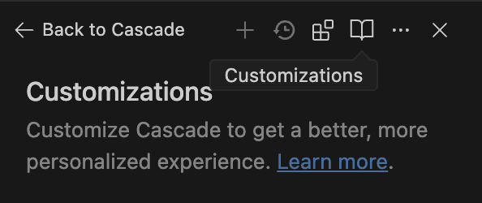
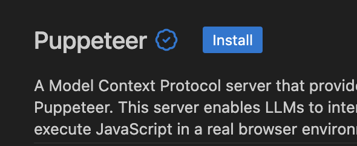
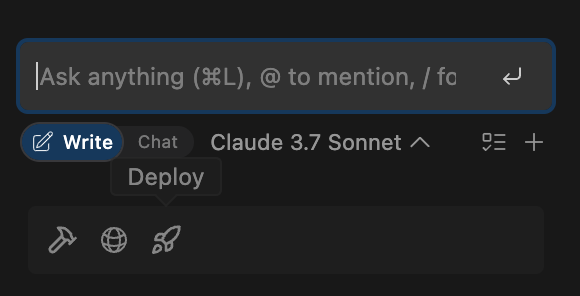

## Credits and Usage

Windsurf uses a credit system to track AI usage across different models. You can monitor your remaining credits in the settings panel, with usage varying based on the model selected—some models are free, others cost credits per message.

To view your credit usage, click the three dots in the top right of the Cascade window and select `Cascade Usage`.


## Rules

Rules are persistent instructions that guide Cascade’s behavior, enforcing things like code style or architectural patterns. You can define global or project-specific rules, which Cascade will follow automatically or on request.

To define rules, click the `Customizations` icon at the top right of the Cascade window.



In the Customizations tab, click the `Rules` tab.


Here, you can add Global Rules (rules applied across all workspaces) and Workspace Rules (rules specific to a single workspace). In this tab, you can see some example rules, which you can modify or delete. To add a new Workspace Rule, click the `+ Workspace` button, give it a name of `full-stack-dev`, and add the following text below to the `Content` section:

```markdown
# General Code Style & Formatting

- Use PascalCase for React component file names (e.g., UserCard.tsx, not user-card.tsx).
- Prefer named exports for components.

# Project Structure & Architecture

- My project is a full-stack application built with Next.js and Flask inside of the contact-form-app folder.
- Follow Next.js patterns and use the Pages Router.
- Correctly determine when to use server vs. client components in Next.js.

# State Management & Logic

- Use React Context for state management.

# Backend

- The backend is built in Flask.
```

Once you've saved the file, select `Always On` for the Activation Mode.


## Workflows

Workflows are reusable sequences of steps that automate common tasks (like responding to PRs or deploying services). They’re defined in markdown and can be triggered via slash commands in Cascade.

To define workflows, click the `Customizations` icon at the top right of the Cascade window.


In the Customizations tab, click the `Workflows` tab.


Here, you can add Workflows to your workspace. In this tab, you can see some example workflows, which you can modify or delete. To add a new Workflow, click the `+ Workflow` button, give it a description of `Run the project`, and add the following text below to the `Content` section:

```markdown
1. Navigate to the contact-form-app directory
2. Start a terminal
3. Navigate to the 'frontend' directory
4. Check dependencies and install if necessary
5. Run the 'npm start' command
6. Start a second terminal
7. Navigate to the 'backend' directory
8. Create venv if necessary and install dependencies; otherwise, activate venv
9. Run the 'python3 app.py' command
```

Once you've saved the file, you can run the workflow by typing `/run-project` in the Cascade window.

## Plugins (MCP)

Plugins extend Cascade’s capabilities by connecting it to external tools (like GitHub or Figma) via the Model Context Protocol (MCP). You can install, manage, and configure plugins directly from the IDE.

To install plugins, click the `Plugins` icon at the top right of the Cascade window.


Select Puppeteer from the list of available plugins and click the 'Install' button.



In the Cascade window, you can now use Puppeteer to automate tasks like clicking buttons or filling out forms. Try it out by asking Cascade to `Navigate to https://windsurf.com/. Find the Pricing section and navigate to it. Take a screenshot of the resulting screen.`.

## Deploy

With one click, you can deploy your app directly from the IDE using Windsurf’s integration with Netlify. Cascade handles the build and deployment, giving you a live URL for sharing or testing.

To deploy your application, you can click the `Deploy` icon under the chatbox in the Cascade window or tell Cascade to `Deploy my application`. Cascade will then deploy your application and give you a live URL for your frontend application.


