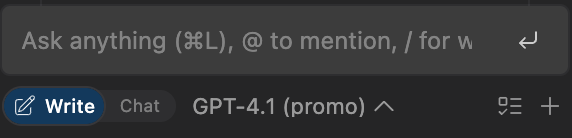
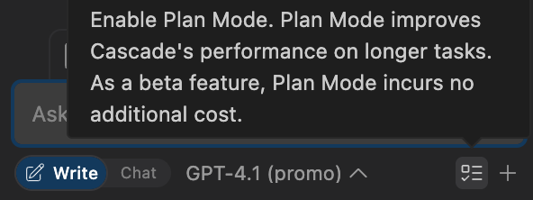
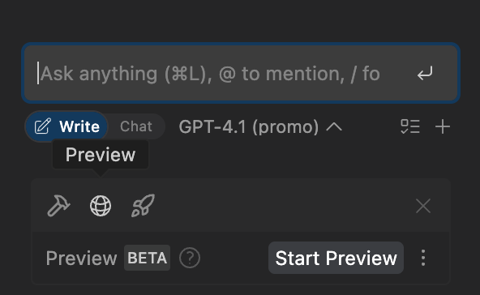
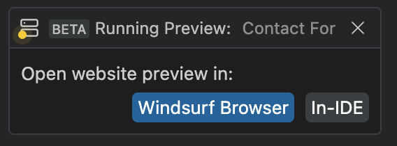

# Windsurf Cascade 

Windsurf Cascade is a Collaborative, Agentic AI-assistant and is the natural evolution of a Chat Assistant. Cascade has access to research your code base, invoke tools to edit your code and run terminal commands, and understand your recent actions (your current trajectory) to derive your next intent.

**Note:** Cascade is highly flexible as an Agentic System. This demo will walk through some of Cascade's core capabilities, but will be nonexhaustive.

## Setup

### Write and Chat Mode
Cascade offers two interaction modes:


- **Write** – for directly generating and modifying code.
- **Chat** – for asking questions or exploring ideas *without* immediate file changes.

You can toggle between them to match your workflow and intent.



Example 1: 
Enable chat mode in Cascade. Try asking Cascade to
```text
    Explain how ContactForm works and how the form submission is handled
```
As you can see, Cascade will analyze your files and provide a detailed overview of the form logic. Chat is a great way to explore unfamiliar databases and reason over implementation logic.

Example 2:
Enable write mode in Cascade. Try asking Cascade to
```text
    Add a required Company Name input field to the contact form. It should appear below the Email field and be included in the handleSubmit function’s validation logic
```
With write mode, Cascade can generate and modify code to implement your prompt, asking for clarification or permission to run terminal commands as necessary. 

## Credits and Usage

## Selecting Your Models
Cascade supports a wide range of models to provide maximum developer optionality. You can freely switch between various models in the same Cascade conversation to balance cost, performance, and speed. 


Explore prompting with different models to find the best models for your use case! Try prompting Cascade to explain the form validation logic with different models to see the differences in responses. 

Generally, users will find that models such as OpenAI o3, Claude 3.7 Sonnet (Thinking), and Gemini 2.5 Pro work well for planning and implementing complex tasks. For quick implementations and edits, GPT-4.1, SWE-1, and Gemini 2.5 Pro are commonly used.


## Rules

## Memories
Memories let Cascade retain important project context across sessions. Cascade may automatically generate and store memories during conversation or you can explicitly prompt Cascade to store a memory. 

Example:
Ask Cascade to
```text
Create a memory to follow a professional, minimal design for all UI changes
```
Now, Cascade will remember your design preferences even in new conversations. You can manage your various workspace memories using the Customizations tab located in the top right corner of the Cascade panel. 


## Workflows

## Plugins (MCP)   

## Planning Mode            
Planning Mode generates a comprehensive plan that Cascade can refer to and update throughout the implementation of more complex tasks. It’s a powerful tool that enables you to stay in control, reduce errors, and make steady progress, even in large or unfamiliar codebases. 

Example:

In the bottom right corner of the Cascade panel, click the checklist icon to enable planning mode. 



Prompt Cascade to
```text
Create a detailed plan to improve the Contact Form UI: Apply a modern layout with better spacing and alignment. Style input fields and labels to improve accessibility and readability
```

Cascade will generate an implementation plan structured as a local markdown file with clear goals and action items. Once created you can manually edit the plan or ask Cascade for any modifications. 


Now try asking Cascade to begin implementation. Throughout the implementation, Cascade will continuously refer back to the plan, marking items complete and modifying the scope as necessary. 

## Browser Previews         
Previews in Windsurf allow you to view the local deployment of your app either in the IDE or in the browser (optimized for Google Chrome, Arc, and Chromium based browsers) with listeners, allowing you to iterate rapidly by easily sending elements and errors back to Cascade as context.



Example: Click the Preview icon near the Chat box and select start preview. If prompted, install necessary dependencies and start the development server. Select Windsurf Browser when prompted to open your website preview. Once your browser is open try sending context over to Cascade! 




With Select Element you can send specific components such as text boxes and headers to your Cascade prompt. Send Logs will retrieve and send console logs to Cascade. Finally, Screenshot can quickly show Cascade what the current page looks like. 


If you want to see it in action try using Select Element to select the header component. Now, prompt Cascade to change the header color to your favorite color. 

## Deploys
