# Windsurf Cascade 

Windsurf Cascade is a Collaborative, Agentic AI-assistant and is the natural evolution of a Chat Assistant. Cascade has access to research your code base, invoke tools to edit your code and run terminal commands, and understand your recent actions (your current trajectory) to derive your next intent.

**Note:** Cascade is highly flexible as an Agentic System. This demo will walk through some of Cascade's core capabilities, but will be nonexhaustive.

## Table of Contents
- [Set Up](#set-up)
- [Write and Chat Mode](#write-and-chat-mode)
- [Credits and Usage](#credits-and-usage)
- [Selecting Your Models](#selecting-your-models)
- [Rules](#rules)
- [Memories](#memories)
- [Workflows](#workflows)
- [Plugins (MCP)](#plugins-mcp)
- [Planning Mode](#planning-mode)
- [Browser Previews](#browser-previews)
- [Deploy](#deploy)

## Set Up

To get started and see your changes live in the in-IDE preview, just send Cascade this prompt in the Cascade window on the right side of the IDE:

```
Install all dependencies for my project and launch an in-IDE browser preview of my website.
```

Cascade will automatically analyze your codebase, suggest relevant commands, and handle the setup process for you.

<div style="margin: 24px 0;">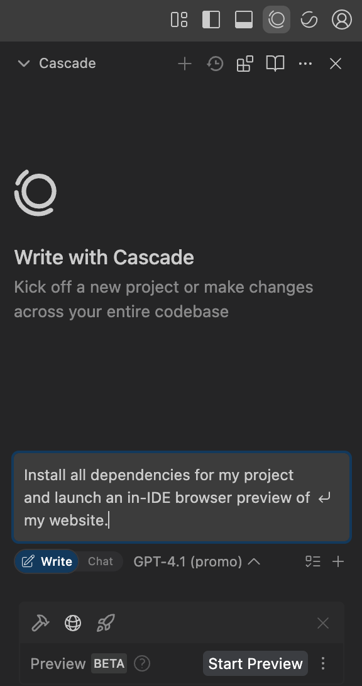</div>

## Write and Chat Mode
Cascade offers two interaction modes:


- **Write** – for directly generating and modifying code.
- **Chat** – for asking questions or exploring ideas *without* immediate file changes.

You can toggle between them to match your workflow and intent.

<div style="margin: 24px 0;"></div>

> **Try this:**
> Enable chat mode in Cascade. Try asking Cascade to
> ```text
> Explain how ContactForm works and how the form submission is handled
> ```

As you can see, Cascade will analyze your files and provide a detailed overview of the form logic. Chat is a great way to explore unfamiliar databases and reason over implementation logic.

> **Try this:**
> Enable write mode in Cascade. Try asking Cascade to
> ```text
> Add a required Company Name input field to the contact form. It should appear below the Email field and be included in the handleSubmit function’s validation logic
> ```

With write mode, Cascade can generate and modify code to implement your prompt, asking for clarification or permission to run terminal commands as necessary. 

## Credits and Usage

Windsurf uses a credit system to track AI usage across different models. You can monitor your remaining credits in the settings panel, with usage varying based on the model selected—some models are free, others cost credits per message.

To view your credit usage, click the three dots in the top right of the Cascade window and select `Cascade Usage`.

<div style="margin: 24px 0;">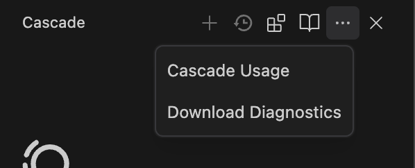</div>

## Selecting Your Models
Cascade supports a wide range of models to provide maximum developer optionality. You can freely switch between various models in the same Cascade conversation to balance cost, performance, and speed. 

<div style="margin: 24px 0;">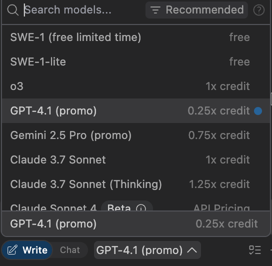</div>

Explore prompting with different models to find the best models for your use case! Try prompting Cascade to explain the form validation logic with different models to see the differences in responses. 

Credit costs and performance will vary by model. Here are some general recommendations that have worked well for Windsurf users:

| Model                        | Suggested Use Case                      | Credit Cost                     |
| :--------------------------- | :-------------------------------------- | :------------------------------ |
| OpenAI o3                    | Planning and implementing complex tasks | Flat Rate                        |
| Claude 3.7 Sonnet | Planning and implementing complex tasks | Flat Rate                        |
| Claude Sonnet 4              | Planning and implementing complex tasks | Dynamic Pricing                    |
| Gemini 2.5 Pro               | Great general purpose model | Flat Rate                   |
| GPT-4.1                      | Quick implementations and edits         | Flat Rate                    |
| SWE-1                        | Quick implementations and edits         | Flat Rate             |

Visit https://docs.windsurf.com/windsurf/models for more details.

## Rules

Rules are persistent instructions that guide Cascade’s behavior, enforcing things like code style or architectural patterns. You can define global or project-specific rules, which Cascade will follow automatically or on request.

To define rules, click the `Customizations` icon at the top right of the Cascade window.

<div style="margin: 24px 0;">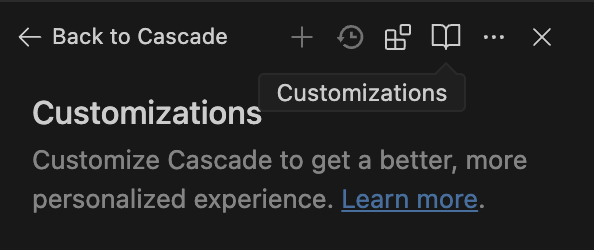</div>

In the Customizations tab, click the `Rules` tab.

<div style="margin: 24px 0;">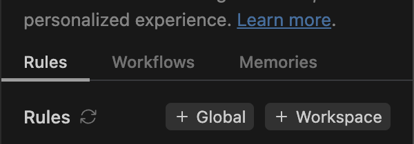</div>

Here, you can add Global Rules (rules applied across all workspaces) and Workspace Rules (rules specific to a single workspace). In this tab, you can see some example rules, which you can modify or delete. To add a new Workspace Rule, click the `+ Workspace` button, give it a name of `full-stack-dev`, and add the following text below to the `Content` section:

```markdown
# General Code Style & Formatting

- Use PascalCase for React component file names (e.g., UserCard.tsx, not user-card.tsx).
- Prefer named exports for components.

# Project Structure & Architecture

- My project is a full-stack application built with Next.js and Flask inside of the contact-form-app folder.
- Follow Next.js patterns and use the Pages Router.
- Correctly determine when to use server vs. client components in Next.js.

# State Management & Logic

- Use React Context for state management.

# Backend

- The backend is built in Flask.
```

Once you've saved the file, select `Always On` for the Activation Mode.

<div style="margin: 24px 0;">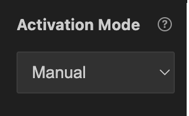</div>


## Memories
Memories let Cascade retain important project context across conversations. Cascade may automatically generate and store memories during conversation or you can explicitly prompt Cascade to store a memory. 

> **Try this:**
> Ask Cascade to
> ```text
> Create a memory to follow a professional, minimal design for all UI changes
> ```

Now, Cascade will remember your design preferences even in new conversations. You can manage your various workspace memories using the `Customizations` tab located in the top right corner of the Cascade panel. 

<div style="margin: 24px 0;">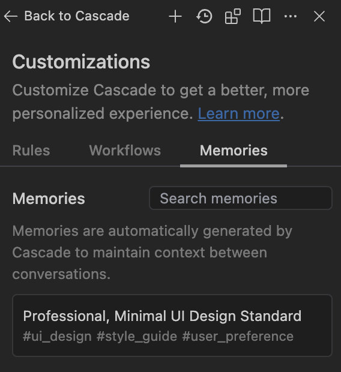</div>

## Workflows

Workflows are reusable sequences of steps that automate common tasks (like responding to PRs or deploying services). They’re defined in markdown and can be triggered via slash commands in Cascade.

To define workflows, click the `Customizations` icon at the top right of the Cascade window.

<div style="margin: 24px 0;"></div>

In the Customizations tab, click the `Workflows` tab.

<div style="margin: 24px 0;">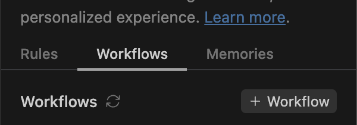</div>

Here, you can add Workflows to your workspace. In this tab, you can see some example workflows, which you can modify or delete. To add a new Workflow, click the `+ Workflow` button, give it a description of `Run the project`, and add the following text below to the `Content` section:

```markdown
1. Navigate to the contact-form-app directory
2. Start a terminal
3. Navigate to the 'frontend' directory
4. Check dependencies and install if necessary
5. Run the 'npm start' command
6. Start a second terminal
7. Navigate to the 'backend' directory
8. Create venv if necessary and install dependencies; otherwise, activate venv
9. Run the 'python3 app.py' command
```

Once you've saved the file, you can run the workflow by typing `/run-project` in the Cascade window.

## Plugins (MCP)

Plugins extend Cascade’s capabilities by connecting it to external tools (like GitHub or Figma) via the Model Context Protocol (MCP). You can install, manage, and configure plugins directly from the IDE.

To install plugins, click the `Plugins` icon at the top right of the Cascade window.

<div style="margin: 24px 0;"><div style="margin: 24px 0;">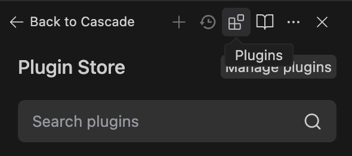</div></div>

Select Puppeteer from the list of available plugins and click the 'Install' button.

<div style="margin: 24px 0;"><div style="margin: 24px 0;">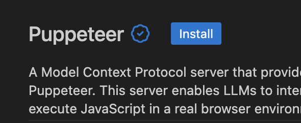</div></div>

In the Cascade window, you can now use Puppeteer to automate tasks like clicking buttons or filling out forms. Try it out by asking Cascade to `Navigate to https://windsurf.com/. Find the Pricing section and navigate to it. Take a screenshot of the resulting screen.`.

## Planning Mode            
Planning Mode generates a comprehensive plan that Cascade can refer to and update throughout the implementation of more complex tasks. It’s a powerful tool that enables you to stay in control, reduce errors, and make steady progress, even in large or unfamiliar codebases. 

> **Try this:**
> In the bottom right corner of the Cascade panel, click the checklist icon to enable planning mode. 

<div style="margin: 24px 0;"></div>

> **Try this:**
> Prompt Cascade to
>```text
>Create a detailed plan to improve the Contact Form UI: Apply a modern layout with better spacing and alignment. Style input fields and labels to improve accessibility and readability
>```

Cascade will generate an implementation plan structured as a local markdown file with clear goals and action items. Once created you can manually edit the plan or ask Cascade for any modifications. 

<div style="margin: 24px 0;">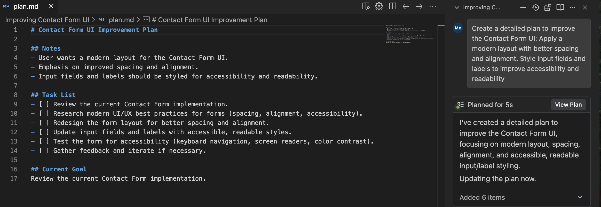</div>

Now try asking Cascade to begin implementation. Throughout the implementation, Cascade will continuously refer back to the plan, marking items complete and modifying the scope as necessary. 

## Browser Previews

Windsurf supports two powerful preview options to accelerate your development workflow: an in-IDE preview for rapid iteration, and the Windsurf Browser Preview, a fully functional AI-integrated browser.

### In-IDE Preview
- **Live Preview:** Run your web application and interact with it directly inside the IDE.
- **Real-Time Debugging:** View console logs, inspect errors, and debug issues without switching contexts.
- **Element Selection:** Select UI elements in the preview and ask Cascade to show you the related source code or event handlers.

### Windsurf Browser Preview
- **Browser Experience:** Open your running app in the Windsurf Browser, optimized for Chrome/Arc/Chromium.
- **Maximum Flow Awareness:** Select elements, console logs, or screenshots to send as context directly to Cascade.
- **Immediate Feedback:** See code changes reflected instantly in the browser preview.

<div style="margin: 24px 0;"></div>

> **Try this:**  
> Click the Preview icon near the chat box and select "Start Preview". Choose either the in-IDE preview or Windsurf Browser when prompted. Select elements in the preview and ask Cascade about their implementation or to make changes.  
> _Note: Windsurf Browser may be currently unavailable for enterprise users._

<div style="margin: 24px 0;"></div>

Here, we have the Windsurf Browser Preview open. You can:
- **Select Element:** Send specific components (such as text boxes or headers) directly to your Cascade prompt for targeted questions or edits.
- **Send Logs:** Instantly share console logs from the preview with Cascade for debugging help.
- **Screenshot:** Capture and send a snapshot of your current page to Cascade for visual context.

<div style="margin: 24px 0;">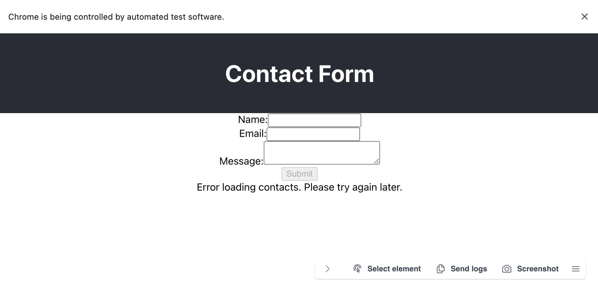</div>

If you want to see it in action, try using Select Element to pick the header component. Then prompt Cascade to change the header color to your favorite color.

## Deploy

With one click, you can deploy your app directly from the IDE using Windsurf’s integration with Netlify. Cascade handles the build and deployment, giving you a live URL for sharing or testing.

To deploy your application, you can click the `Deploy` icon under the chatbox in the Cascade window or tell Cascade to `Deploy my application`. Cascade will then deploy your application and give you a live URL for your frontend application.

<div style="margin: 24px 0;">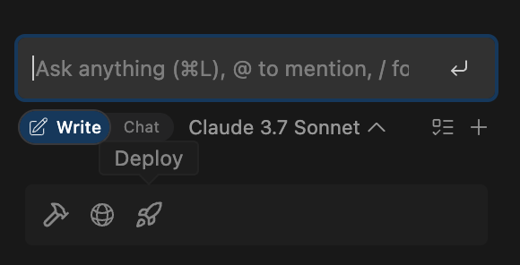</div>

