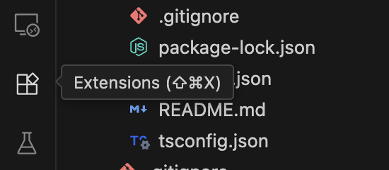

# Windsurf Editor

## Extension Marketplace

### Linters

Linters are tools that analyze code and report on potential errors, style violations, and other issues. You can install linters via the `Extensions` tab on the left side of the editor.

This project has a mix of TypeScript and Python files, so we'll install a linter for both. Search for `ESLint` and install the one shown below. Then search for `Pylint` and install the one shown below.

    
    

ESLint and Pylint have already been configured in this project, so you can run `npm run eslint` in the `frontend` directory or open a Python file to see linting errors and warnings.

### Code Formatters

Code formatters are tools that automatically format code to a consistent style. You can install code formatters via the `Extensions` tab on the left side of the editor.

Search for `Prettier` and install the one shown below.

To run Prettier, you can hit `Shift + Alt/Option + F` to format a file. You can also configure the code formatter to run on save. To do so, hit `Cmd/Ctrl + Shift + P` and search for `Open User Settings`. Select the non-JSON option and then search for `Format on Save` in the search box. Check the box next to this setting. Then, search for `default formatter` in the search box and select `Prettier - Code formatter`.
