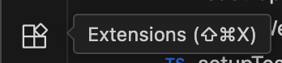
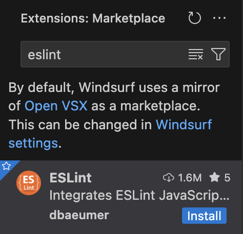
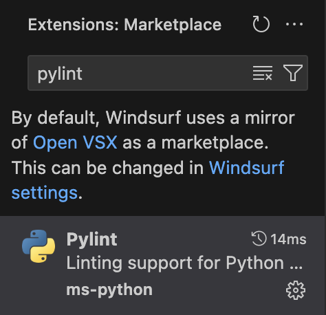
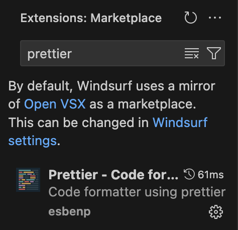
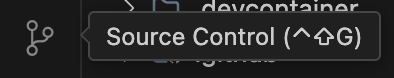
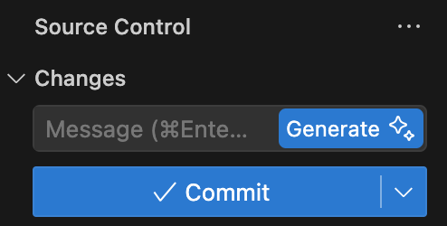
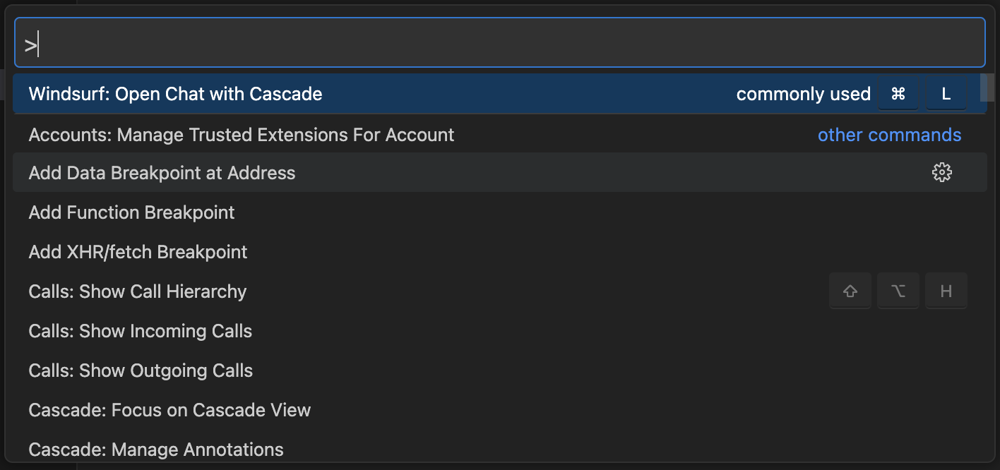
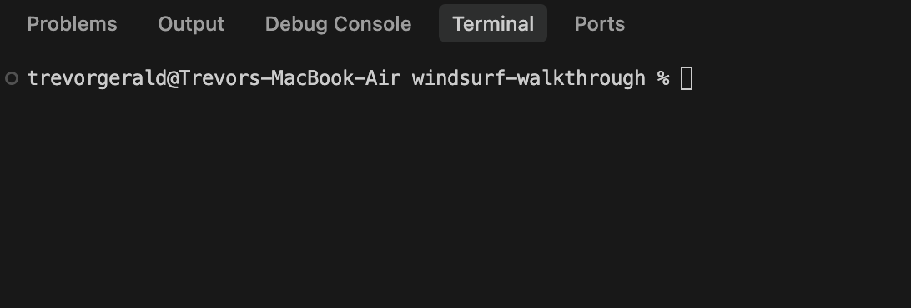
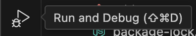
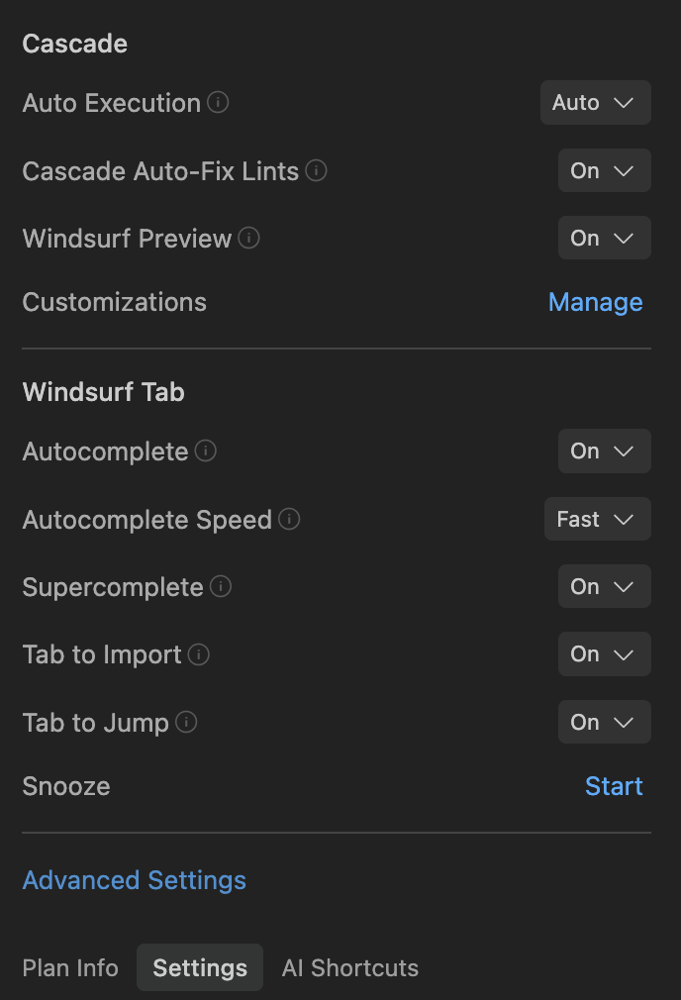

# Windsurf Editor

## Table of Contents

- [Extensions](#extensions)
- [Source Control](#source-control)
- [Command Palette](#command-palette)
- [Run and Debug](#run-and-debug)
- [Bottom Panel](#bottom-panel)
- [Common IDE Tasks](#common-ide-tasks)
- [Common Windsurf Keyboard Shortcuts](#common-windsurf-keyboard-shortcuts)
- [Windsurf Settings](#windsurf-settings)

---

### Extensions

You can access the `Extensions` tab by clicking the icons on the left sidebar in the editor or hitting `Shift + Cmd/Ctrl + X`. You can install extensions to add new features and functionality to the editor.



#### Linters

Linters are tools that analyze code and report on potential errors, style violations, and other issues. You can install linters via the `Extensions` tab on the left side of the editor.

This project has a mix of TypeScript and Python files, so we'll install a linter for both. Search for `ESLint` and install the one shown below. Then search for `Pylint` and install the one shown below.

<div style="display: flex; justify-content: center; flex-direction: row; margin-bottom: 20px;">
    
    
</div>

ESLint and Pylint have already been configured in this project, so you can run `npm run eslint` in the `frontend` directory or open a Python file to see linting errors and warnings.

#### Code Formatters

Code formatters are tools that automatically format code to a consistent style. You can install code formatters via the `Extensions` tab on the left side of the editor.

Search for `Prettier` and install the one shown below.



To run Prettier, you can hit `Shift + Alt/Option + F` to format a file. You can also configure the code formatter to run on save. To do so, hit `Cmd/Ctrl + Shift + P` and search for `Open User Settings`. Select the non-JSON option and then search for `Format on Save` in the search box. Check the box next to this setting. Then, search for `default formatter` in the search box and select `Prettier - Code formatter`.

---

### Source Control

The editor has integrated source control management (SCM) and includes Git support out-of-the-box. Many other source control providers are available through the Extensions Marketplace. You can access the `Source Control` tab by clicking the icons on the left sidebar in the editor or hitting `Cmd/Ctrl + Shift + G`.



#### Generate Commit Messages

In Windsurf, you can generate commit messages by clicking the `Generate` button in the Source Control tab. This will generate a commit message based on the changes (staged and unstaged) in the repository.



Alternatively, you can set up a workflow to use [GitHub's MCP Server](https://github.com/github/github-mcp-server), stage all changes, create the commit message and description, and commit it.

---

### Command Palette

The Command Palette is a powerful tool that allows you to run commands and access features in the editor. You can open the Command Palette by hitting `Cmd/Ctrl + Shift + P`.



#### Common Commands

##### Reload Window

If something does not mount correctly in the editor, you can reload the window by hitting `Cmd/Ctrl + Shift + P` to bring up the Command Palette and searching for `Reload Window`. Alternatively, you can hit `Cmd/Ctrl + R` to reload the window.

---

### Bottom Panel

The bottom panel is a powerful tool that allows you to run commands and access various features in the editor. You can open/close the bottom panel by hitting `Cmd/Ctrl + J`.



#### Problems

Displays errors and warnings in your code from linters, compilers, and other tools. Clicking an item takes you to the source line.

#### Output

Shows output from various VS Code processes and extensions (e.g., Git, build tools, extensions).

#### Debug Console

Lets you interact with your running application during debugging, view variable output, and evaluate expressions.

#### Terminal

Provides a built-in command-line terminal for running scripts, commands, and version control directly within the editor.

#### Ports

Lists forwarded ports when working with remote development environments, containers, or cloud workspaces.

---

### Common IDE Tasks

#### Searching for Code

##### Native Search

You can search through files by hitting `Cmd/Ctrl + Shift + F` and typing your search query. This will perform a regex search through the files in your workspace.

##### Cascade Enhancements

- Once you've searched for code, you can drag the search results into the Cascade panel to make edits or ask questions about the code.
- Alternatively, you can use Cascade to semantically search for code/functionality in your codebase.

#### Git Workflows

##### Native Approach

You can use the built-in Git features in the Source Control tab in the editor to manage your changes with your repository.

##### Cascade Enhancements

You can use Workflows to accelerate your Git workflows. Here are some example Workflows:

**Stage and Commit Changes**
```markdown
## Workflow: Stage and Commit Changes

**Trigger:** When developer requests to commit via prompt or context menu

**Steps:**
1. Scan the working directory for unstaged and staged files.
2. If no files are staged, prompt:  
   "_No files are staged. Would you like me to stage all modified files?_"
3. Once files are staged, summarize the changes:
   - Group by file
   - Highlight what each change accomplishes
4. Generate a commit message using a conventional format (e.g. Conventional Commits).
   - Example: `feat(user-profile): add avatar upload logic`
5. Confirm with the developer:
   - "_Use this commit message? [Y/n]_"
6. Execute:  
   ```bash
   git commit -m "<generated-message>"
```

---

**Create Pull Requests**
```markdown
## Workflow: Create Pull Request

**Trigger:** Developer pushes a feature branch and requests a PR

**Steps:**
1. Detect current branch and its target base (default to `develop` or `main`).
2. Summarize all changes between source and target branch:
   - Key features added, bugs fixed, files changed
3. Auto-generate:
   - PR title: based on branch name or major change
   - PR body: bulleted summary of features, testing notes, and related issues
4. Prompt for reviewer tags or labels (e.g., `review`, `needs-docs`)
5. Execute API call to GitHub/GitLab to open PR.
6. Confirm with a link to the PR:  
   "_Pull request created: [link]_"
```

---

**Merge Branches**
```markdown
## Workflow: Merge Branches

**Trigger:** Developer initiates merge request in IDE

**Steps:**
1. Confirm target and source branch:
   - "_Merge `feature/x` into `develop`?_"
2. Fetch and rebase `feature/x` against `develop` (if rebase strategy is preferred).
3. Check for conflicts:
   - If none, perform a fast-forward or merge.
   - If conflicts exist, switch to conflict resolution workflow.
4. Confirm with the user:
   - "_Proceed with merge and delete source branch?_"
5. Finalize with:
   ```bash
   git merge feature/x
   git branch -d feature/x
```

---

**Generate Changelogs**
```markdown
## Workflow: Generate Changelogs

**Trigger:** Developer prepares a release or requests changelog generation

**Steps:**
1. Determine the commit range (e.g., last tag to HEAD, or last N PRs).
2. Parse commit messages using Conventional Commits or PR titles.
3. Categorize entries:
   - `Features`, `Fixes`, `Chores`, `Docs`, etc.
4. Format the changelog in Markdown:
   ```markdown
   ## [1.4.0] - 2025-06-20
   ### Added
   - Add support for dark mode in settings panel

   ### Fixed
   - Resolve crash when syncing large files

   ### Chores
   - Upgrade dependency: Axios 1.2.4 → 1.3.0
   ```

---

### Run and Debug

The editor has a `Run and Debug` tab that allows you to run and debug code. You can access the `Run and Debug` tab by clicking the icon in the left sidebar of the editor or hitting `Shift + Cmd/Ctrl + D`.



---

### Common Windsurf Keyboard Shortcuts

| Action                 | Windsurf (MacOS)       | Windsurf (Windows/Linux) | Jetbrains (MacOS)           | Jetbrains (Windows/Linux)    |
|------------------------|------------------------|---------------------------|------------------------------|-------------------------------|
| Open Cascade Panel     | *Cmd ⌘ + L*            | *Ctrl + L*                | *Cmd ⌘ + Shift + L*         | *Ctrl + Shift + L*           |
| Invoke Command         | *Cmd ⌘ + I*            | *Ctrl + I*                | *Cmd ⌘ + I*                  | *Ctrl + I*                    |
| Accept Autocomplete    | *Tab*                  | *Tab*                     | *Tab*                        | *Tab*                         |
| Accept All Diffs       | *Cmd ⌘ + Return*       | *Ctrl + Enter*            | *Custom*                     | *Custom*                      |
| Reject All Diffs       | *Cmd ⌘ + Delete*       | *Ctrl + Backspace*        | *Custom*                     | *Custom*                      |

---

### Windsurf Settings

To configure Cascade and Tab behvaviors, you can click the `Windsurf - Settings` button in the bottom right of the editor. Here, you will see Plan Info, Settings, and AI Shortcuts. Click on the Settings tab to edit settings related to Cascade and Tab.



#### Advanced Settings

If you click on the `Advanced Settings` hyperlink in the Settings tab of `Windsurf - Settings` (see picture above), you will see a list of settings that you can configure.

##### General

The `General` settings allow you to manage core application preferences, including marketplace configuration, editor settings access, and visual customization like the app icon.

##### Cascade

The `Cascade` section controls how Cascade operates within Windsurf, including plugin management, credit usage, background behavior, memory and workflow automation, and advanced customization options to tailor Cascade’s assistance to your workflow.

##### Editor

The `Editor` section configures the in-editor experience in Windsurf, including UI elements like inlay hints and selection popups, as well as autocomplete behavior, context usage, and smart editing features to streamline writing and navigation.

##### Shortcuts

The `Shortcuts` section lets you manage keybindings for common actions like opening the command menu or Cascade chat. In this section, you can also view all shortcuts/keybindings and edit them or reset them to defaults.

##### Advanced

The `Advanced` section includes low-level settings for proxy detection and workspace indexing limits, allowing control over network configuration and the scale of file analysis within Windsurf.
